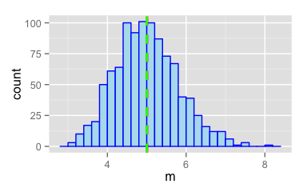
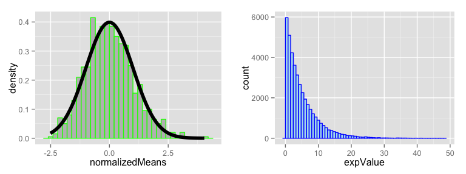

# Statistical Inference: Simulations of Exponential Distributions
Sheldon White (sheldonwhite@comcast.net)  


### Overview
The goal of this assignment is to examine the statistical properties of the Exponential Distribution. Specifically, we want to see if the distribution and variance of sample data sets match the expected values (based on known properties of the distribution).

Some of the properties of the Exponential Distribution [(Wikipedia reference)](http://en.wikipedia.org/wiki/Exponential_distribution#Mean.2C_variance.2C_moments_and_median)

(This distribution is defined in terms of an exponential factor _lambda_)

* The mean (and the expected value) of the Exponential Distribution = 1 / lambda
* The Variance of the Exponential Distribution = 1 / lambda^2
* The Standard Deviation the Exponential Distribution = 1/lambda

### Creating a Simulation Data Set
(This is patterned off of simulation code in Lecture 7.)

We do the following steps 1000 times:

1. Get a sample of 40 data points produced by the rexp() functions, using a lambda of 0.2
2. Save the mean of the 40 points


```r
# Some global values for our simulation
runCount = 1000
sampleSize = 40
lambda = 0.2
populationVariance = 1 / lambda^2
populationStdError = sqrt(populationVariance)
mns = c()
for (i in 1 : runCount) mns = c(mns, mean(rexp(sampleSize, lambda)))
mnsFrame = data.frame(m = mns)
```

One thing we expect is that the sample mean should converge to the population means as the sample size increases. Let's compare the mean of our samples with the expected value:


```r
expectedMean = 1 / lambda
sampleMean = mean(mns)
message("sample mean = ", sampleMean, "\nexpected mean = ", expectedMean)
```

```
## sample mean = 5.00751508594831
## expected mean = 5
```
_So the sample mean is close to the population mean._

Also, we know that the variance of the sample mean should converge to (population variance) / (sample size). Let's check this: 

```r
expectedVariance = populationVariance / sampleSize
sampleVariance = var(mns)
message("sample variance = ", sampleVariance, "\nexpected variance = ", expectedVariance)
```

```
## sample variance = 0.636802187553911
## expected variance = 0.625
```
_And the sample variance is close to the population variance._

We can plot a histogram of the means. We also mark the calculated mean in red and the expected mean in green:


```r
library(ggplot2)
library(gridExtra)
```

```
## Loading required package: grid
```

```r
p = ggplot(mnsFrame, aes(x = m)) +
    geom_histogram(fill="lightblue2", colour="blue", binwidth = 0.2) +
    geom_vline(aes(xintercept=sampleMean), color="red", linetype="dashed", size=1) +
    geom_vline(aes(xintercept=expectedMean), color="green", linetype="dashed", size=1)
print(p)
```

 

Another point was raised in lecture 7. One of the implications of the Central Limit Theorem is that normalized averages of IID variables trends towards the standard normal as the sample sizes increase. So this:

$$\frac{\bar X_n - \mu}{\sigma / \sqrt{n}}=
\frac{\sqrt n (\bar X_n - \mu)}{\sigma}
= \frac{\mbox{Estimate} - \mbox{Mean of estimate}}{\mbox{Std. Err. of estimate}}$$ has a distribution like that of a standard normal for large $n$. We'll perform this with our data set, displaying it side-by-side with a histogram of the equivalent number of samples of the exponential distribution.


```r
# create the normalized distribution
cfunc = function(runMean, n) sqrt(n) * (runMean - expectedMean) / populationStdError
mnsFrame$normalizedMeans = cfunc(mnsFrame$m, sampleSize)
p1 = ggplot(mnsFrame, aes(x = normalizedMeans)) +
    geom_histogram(fill = "grey", colour = "green", binwidth = 0.2, aes(y = ..density..)) +
    stat_function(fun = dnorm, size = 2)
# plot a histogram of 40,000 exponential distributions
exponentials = rexp(sampleSize * runCount, lambda)
frame = data.frame(expValue = exponentials)

p2 = ggplot(frame, aes(x = expValue)) +
    geom_histogram(fill="lightblue2", colour="blue", binwidth = 0.8)
grid.arrange(p1, p2, ncol=2)
```

 

The normalized means are _roughly_ standard normal, completely different than the appearance of the underlying exponential distribution. Larger sample sizes would produce a better normal distribution; samples of 40 show a lot of random fluctuations.

---

```r
sessionInfo()
```

```
## R version 3.1.0 (2014-04-10)
## Platform: x86_64-apple-darwin13.1.0 (64-bit)
## 
## locale:
## [1] en_US.UTF-8/en_US.UTF-8/en_US.UTF-8/C/en_US.UTF-8/en_US.UTF-8
## 
## attached base packages:
## [1] grid      stats     graphics  grDevices utils     datasets  methods  
## [8] base     
## 
## other attached packages:
## [1] gridExtra_0.9.1 ggplot2_1.0.0  
## 
## loaded via a namespace (and not attached):
##  [1] colorspace_1.2-4 digest_0.6.4     evaluate_0.5.5   formatR_0.10    
##  [5] gtable_0.1.2     htmltools_0.2.4  knitr_1.6        labeling_0.2    
##  [9] MASS_7.3-33      munsell_0.4.2    plyr_1.8.1       proto_0.3-10    
## [13] Rcpp_0.11.2      reshape2_1.4     rmarkdown_0.2.49 scales_0.2.4    
## [17] stringr_0.6.2    tools_3.1.0      yaml_2.1.13
```
