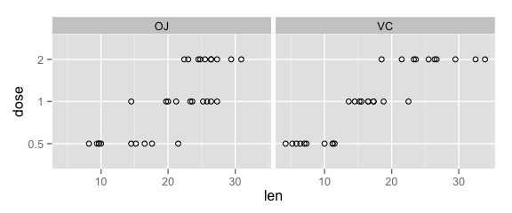

# Statistical Inference: Analysis of ToothGrowth Data
Sheldon White (sheldonwhite@comcast.net)  


## Data Summary
The ToothGrowth data-set is a set of 60 observations describing the measured tooth growth in Guinea Pigs (which will be referred to as "subjects"). Each subject apparently received supplemental Vitamin C at 0.5, 1.0 or 2.0 milligram levels, either in Orange Juice or pure Vitamin C. The units of the length values are not specified.

We start by a basic plot of the data, segregating the data by supplement type.


```r
library(ggplot2)
data(ToothGrowth)
ToothGrowth$dose = as.factor(ToothGrowth$dose)
ggplot(ToothGrowth, aes(x=len, y=dose)) + geom_point(shape=1) + facet_grid(. ~ supp)      
```

 

Superficially, it looks like for each supplement type, increasing dosages are matched by increasing tooth length values. Let's also look at the variances of the different test groups:


```r
variances = data.frame(supplement = character(0), dosage = character(0), variance = numeric(0))
for (s in c('OJ', 'VC')) {
    for (d in c(0.5, 1, 2)) {
        row = data.frame(s, d, var(subset(ToothGrowth, supp == s & dose == d)$len))
        colnames(row) = c("suppliment", "dosage", "variance")
        variances = rbind(variances, row)
    }
}
knitr::kable(variances, align = 1)
```


|suppliment |dosage |variance |
|:----------|:------|:--------|
|OJ         |0.5    |19.889   |
|OJ         |1.0    |15.296   |
|OJ         |2.0    |7.049    |
|VC         |0.5    |7.544    |
|VC         |1.0    |6.327    |
|VC         |2.0    |23.018   |

Definitely some differences in the variance of the different test groups. The smaller variance values can be visually matched with a tighter grouping of values in the plot (for instance, VC at 1 milligram).

## Hypothesis Tests
We can use t-confidence intervals to perform a series of comparisons between the different sets of subjects. Each test will be framed as a 95% confidence interval for (lengthOfGroup1 - lengthOfGroup1).

#####The assumptions I make in this analysis:

* Each set of 10 Guinea Pigs for a dose/supplement combination are distinct. (Each pig received a single supplement at a single dosage.) A total population of 60 subjects is assumed.
* Each population variance is assumed to be different.

First we create a function to perform a T test on a specified subset of the ToothGrowth data, returning the results in a convenient format. (By default t.test() assumes a non-paired test and unequal variances, which is what we want here.)

```r
generateInterval = function(label, supp1, dose1, supp2, dose2) {
    p = with(ToothGrowth, t.test(len[supp == supp1 & dose == dose1],
                                 len[supp == supp2 & dose == dose2]))
    row = data.frame(label, p$conf.int[1], p$conf.int[2], p$conf.int[2] - p$conf.int[1])
    colnames(row) = c("comparison", "low", "high", "range")
    row
}
```

First, we'll compare equal dosages of the two supplements. Each row addresses the hypothesis "A given dosage of OJ causes greater tooth length than the same dosage of VC." A range that's completely positive confirms the hypothesis, but a range that include the zero point tells us that the conclusion cannot be inferred by the data.


```r
resultsSupp = data.frame(comparison = character(0), low = numeric(0), high = numeric(0), range = numeric(0))
resultsSupp = rbind(resultsSupp, generateInterval("OJ:0.5 - VC:0.5", 'OJ', 0.5, 'VC', 0.5))
resultsSupp = rbind(resultsSupp, generateInterval("OJ:1.0 - VC:1.0", 'OJ', 1, 'VC', 1))
resultsSupp = rbind(resultsSupp, generateInterval("OJ:2.0 - VC:2.0", 'OJ', 2, 'VC', 2))
knitr::kable(resultsSupp, align = 1)
```


|comparison      |low    |high  |range |
|:---------------|:------|:-----|:-----|
|OJ:0.5 - VC:0.5 |1.719  |8.781 |7.062 |
|OJ:1.0 - VC:1.0 |2.802  |9.058 |6.256 |
|OJ:2.0 - VC:2.0 |-3.798 |3.638 |7.436 |

#####We can see that at a dosage of 0.5 and 1 milligrams, the T Confidence intervals are completely greater than zero and we are justified in claiming a greater tooth length from the OJ supplements. At the dosage level of 2 milligrams, the range is basically centered around zero and we can't conclude anything from this data.

Next, we'll compare different dosages of a single supplement. Each row addresses the hypothesis "A larger dosage of a supplement causes greater tooth length than a lesser dosage of the same supplement." A range that's completely positive confirms the hypothesis, but a range that include the zero point tells us that the conclusion cannot be inferred by the data.


```r
resultsDose = data.frame(label = character(0), low = numeric(0), high = integer(0))
resultsDose = rbind(resultsDose, generateInterval("OJ:1.0 - OJ:0.5", 'OJ', 1, 'OJ', 0.5))
resultsDose = rbind(resultsDose, generateInterval("OJ:2.0 - OJ:1.0", 'OJ', 2, 'OJ', 1))
resultsDose = rbind(resultsDose, generateInterval("OJ:2.0 - OJ:0.5", 'OJ', 2, 'OJ', 0.5))
resultsDose = rbind(resultsDose, generateInterval("VC:1.0 - VC:0.5", 'VC', 1, 'VC', 0.5))
resultsDose = rbind(resultsDose, generateInterval("VC:2.0 - VC:1.0", 'VC', 2, 'VC', 1))
resultsDose = rbind(resultsDose, generateInterval("VC:2.0 - VC:0.5", 'VC', 2, 'VC', 0.5))
knitr::kable(resultsDose, align = 1)
```


|comparison      |low     |high   |range |
|:---------------|:-------|:------|:-----|
|OJ:1.0 - OJ:0.5 |5.5244  |13.416 |7.891 |
|OJ:2.0 - OJ:1.0 |0.1886  |6.531  |6.343 |
|OJ:2.0 - OJ:0.5 |9.3248  |16.335 |7.011 |
|VC:1.0 - VC:0.5 |6.3143  |11.266 |4.951 |
|VC:2.0 - VC:1.0 |5.6857  |13.054 |7.369 |
|VC:2.0 - VC:0.5 |14.4185 |21.901 |7.483 |

#####In all cases, a larger dosage appears to result in greater tooth growth. The most questionable case is comparing OJ at 2 milligrams versus OJ at 1 milligram. Here the lower bound of the range is very close to zero and we probably have the least confidence about this prediction.


---

```r
sessionInfo()
```

```
## R version 3.1.0 (2014-04-10)
## Platform: x86_64-apple-darwin13.1.0 (64-bit)
## 
## locale:
## [1] en_US.UTF-8/en_US.UTF-8/en_US.UTF-8/C/en_US.UTF-8/en_US.UTF-8
## 
## attached base packages:
## [1] stats     graphics  grDevices utils     datasets  methods   base     
## 
## other attached packages:
## [1] ggplot2_1.0.0
## 
## loaded via a namespace (and not attached):
##  [1] colorspace_1.2-4 digest_0.6.4     evaluate_0.5.5   formatR_0.10    
##  [5] grid_3.1.0       gtable_0.1.2     htmltools_0.2.4  knitr_1.6       
##  [9] labeling_0.2     MASS_7.3-33      munsell_0.4.2    plyr_1.8.1      
## [13] proto_0.3-10     Rcpp_0.11.2      reshape2_1.4     rmarkdown_0.2.49
## [17] scales_0.2.4     stringr_0.6.2    tools_3.1.0      yaml_2.1.13
```
